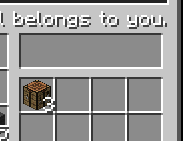

#  GTams - GLobal Trading and Marketing System

The Modding Trials Entry

Requires a GTams-Server Instance running somewhere for its full potential. Further information to follow.

**Important: Read the information on privacy below, to see what data is transmitted to the selected GTams Server!**

## Prerequisites
To be able to use the terminals, an instance of GTams-Server has to be running. The default configuration points to gtams.team-io.net where we run a server for public use.
If the server cannot be reached, terminals will not show any trades and your funds will be 0. They will come back as soon as the server is reachable again.

(Note: Only the minecraft server needs to have access to the GTams Server. Clients connecting to the server do not need a separate connection.)

## Crafting the Trading Terminal


## Using the Trading Terminal

When you open the terminal, you will see something like this:


On the top left, you can see your current funds. New players will receive 50 minecoins as a present. Your budget is specific to the GTams Server. If you log in to other minecraft servers connected to the same GTams Server, you will have the same funds.

You can create new trades to buy or sell items. For this you will need (at the moment) at least one of the items you want to sell or buy.  
Trading works across server boundaries!

When you hover over the red warning sign you will see which information is still required to create a trade.


A complete trade will look like this:  


And the same thing for a trade to buy goods:  


These trades will, however, not match because the amount of goods multiplied with the price per item will exceed the current funds of 50 minecoins.

You will see that the terminal containing the trade to sell will automatically send goods to the GTams Server that are required for completing the trades:  


For testing purposes I have created a smaller trade over 3 items. The traded goods are automatically transferred down into the destination terminal, while the rest of the goods for the selling terminal have been transferred down as well, as there is no open trade anymore.

Customer Terminal:

Vendor Terminal:


**Trade Modes:**
* Once: The trade will be removed after it was completed once.
* Recurring: The trade will be re-issued after the specified time
* Infinite: The trade will be re-issued immediately after processing and will continue as long as sufficient funds/goods are available.

**At the moment, recurring trades are not supported by the GTams Server application and will be treated as if set to 'Infinite'.**

## Trade matching

Trades are matched and processed on the GTams Server, even if you are not online or your terminal is not running - as long as there are sufficient goods online. Since the terminals only supply stock for one occurence of a trade, you will have to be online more often for recurring trades.

All trades are matched from cheapest vendor to cheapest customer, where the oldest trades have priority over other trades with the same price. 
Vendors will be guaranteed to receive *at least the price specified*.  
Customers will be guaranteed to pay *at most the price specified*.  

Trades with partial fulfillment can be matched without reaching the full amount specified.

## Privacy

It is important to know what kind of data we collect. Here is an overview.
All data is collected on the minecraft server - the minecraft client does NOT send information at all.

### Data required for the mod to function:
Whenever a player places a terminal, this information is relayed to the GTams Server. If this is the only terminal active (checked on the minecraft server) for this player, the player status is also sent. This information consists of the profile UUID and optionally the associated username.

The bare minimum of data sent is for creating a terminal:
```
{
  "id": "3954061e-4b43-4759-9937-25cc22cc05fe",
  "owner": "c97b21a8-25e6-37ce-8a04-8d5bcf6f4c4d",
  "online": true
}
```
and for notifying the user status:
```
{
  "id": "c97b21a8-25e6-37ce-8a04-8d5bcf6f4c4d",
  "online": true
}
```

### Optional data:
This data can be turned off in the mod config and is not required for GTams to operate.

By default, sending the user status will include the username for easier maintenance.
```
{
  "id": "c97b21a8-25e6-37ce-8a04-8d5bcf6f4c4d",
  "name": "DataKiller92"
  "online": true
}
```
You can turn this off by setting `transmit_username` to `false` in `config/gtams.cfg`. If turned off, the name will also be deleted on serverside with the next status ping. (Keep in mind that this setting is *Server Specific*, not *User Specific*. If you host a server, make sure your players understand which data is collected! We can also not prevent that another server transmits names for users on servers where this is disabled.)

By default on startup a ping containing some info on your installation is sent to the GTams server. A typical package looks like this:
```
{
  "token": "124d3bc1-c7d7-4c4c-8761-d1004e040443",
  "version": "1.0-alpha1",
  "mcVersion": "1.10.2",
  "branding": "fml,forge",
  "language": "en_US"
}
```
This can be turned off completely by setting `snooping` to `false` in `config/gtams.cfg`.
If snooping is turned off, GTams will only ever contact the GTams Server once, without any request data, to receive a random instance token. If there is already a token present in `gtams_token.cfg`(Not in the config folder) it will not contact the server on startup.

The data sent to the server is not linked to any player information or other data. If you selected the public server at gtams.team-io.net the data is stored on a server in France, as of writing this (2016-08-08).